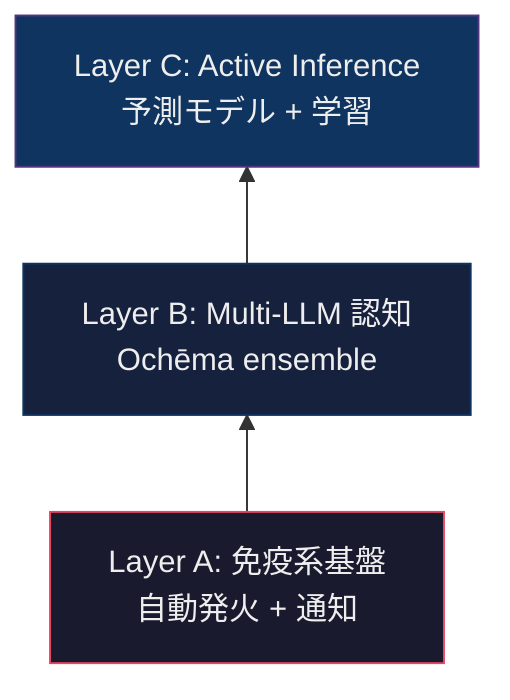
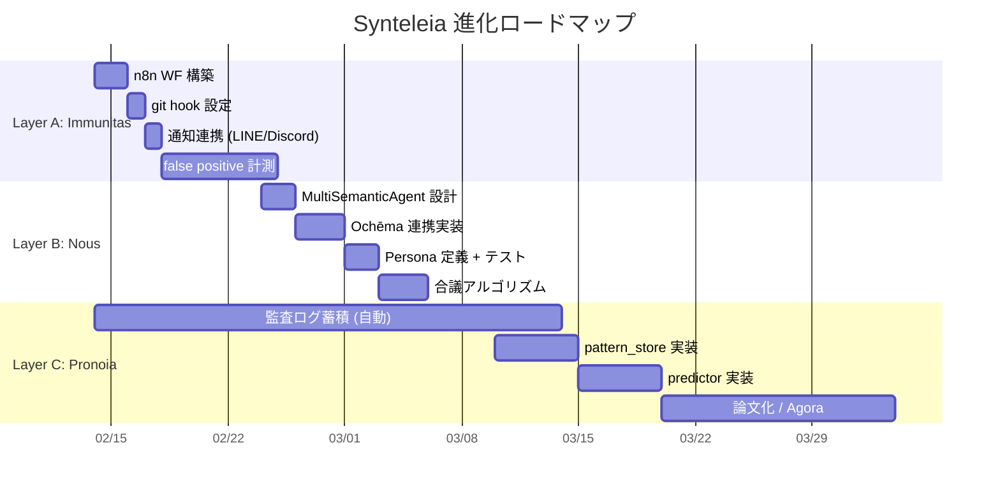

# Synteleia VISION — 免疫系から第二の脳へ

> **CCL 由来**: `/bou+*%/zet+|>/u++` (大局観) → `@ground` (具体化)
> **日付**: 2026-02-13
> **Status**: Draft — Creator 承認待ち

---

## A/B/C は排他的ではない — 積み上がるレイヤーである

先に A/B/C を「3つの未来」として提示したのは誤りだった。
**これらはコンフリクトしない。累積するレイヤーである。**

| 関係 | A→B | B→C |
|:---|:---|:---|
| **依存** | B は A の自動発火インフラの上で動く | C は B の multi-LLM 出力を学習データにする |
| **拡張** | A の L1 regex をB の L2 multi-LLM で補完 | B の静的アンサンブルを C の動的予測で進化 |
| **独立性** | A だけでも免疫系として機能する | B だけでも multiple-perspective として機能する |

---

## 精緻化: 3 Layer 統合 VISION

### Layer A: 免疫系基盤 (Immunitas)

**本質**: Synteleia を「呼び出すもの」から「常に動いているもの」へ

| 6W3H | 回答 |
|:---|:---|
| **What** | 全 git push に対する自動 L1 監査 + 閾値超過時の通知 |
| **Why** | 実装済みの 9 agent を「使う」状態にする。使わない美は美ではない |
| **Who** | n8n WF (自動) → Creator (通知受信) |
| **When** | git push / git commit / cron (1h) |
| **Where** | n8n → HGK API (POST /api/synteleia/audit) → Sympatheia WBC → LINE/Discord |
| **Which** | L1 全 8 agent (高速・低コスト) |
| **How** | n8n WF: git diff → POST /audit → severity check → notify |
| **How much** | CPU のみ (LLM 不要)。1回 < 1秒 |
| **How long** | 1-2日で構築可能 |

**成果物**:

- n8n WF: `synteleia-immunitas.json`
- git hook: `.git/hooks/post-commit` → curl POST
- 通知テンプレート: Slack/LINE/Discord

**成功指標**: 1週間で自動監査 100+ 回実行、false positive 率 < 30%

---

### Layer B: Multi-LLM 認知 (Nous)

**本質**: 単一 LLM call → 複数 LLM の **合議** へ

| 6W3H | 回答 |
|:---|:---|
| **What** | SemanticAgent を Multi-LLM ensemble に拡張 |
| **Why** | 単一 LLM の偏りを排除。「三人寄れば文殊の知恵」 |
| **Who** | Ochēma MCP 経由 (Claude/Gemini/GPT) |
| **When** | Layer A で CRITICAL/HIGH 検出時にのみ発動 (コスト制御) |
| **Where** | SynteleiaOrchestrator.with_l2() を with_multi_l2() に拡張 |
| **Which** | 2-3 models: Claude Sonnet + Gemini Flash + GPT-4.1 |
| **How** | 各モデルに異なる audit persona を付与、majority voting + confidence weighting |
| **How much** | 3 LLM call/発動。月額見積: ~$5 (CRITICAL/HIGH 発動時のみ) |
| **How long** | 1週間 (Ochēma 連携は既に MCP で利用可能) |

**成果物**:

- `mekhane/synteleia/dokimasia/multi_semantic_agent.py`
- Ochēma MCP 連携コード
- Persona 定義 (critic / optimist / pragmatist)
- 合議アルゴリズム (confidence-weighted majority)

**Synedrion との差異**:

- Synedrion = **偉人** の persona (ストア派、圏論家、等)。哲学的・戦略的判断向け
- Multi-LLM Synteleia = **機能的** persona (批判/楽観/実務)。コード/ドキュメント品質向け
- **補完関係**: Synedrion は「何を作るか」、Synteleia は「作ったものが壊れていないか」

**成功指標**: L2 multi-LLM の CRITICAL 検出率が単一 LLM より 20%+ 向上

---

### Layer C: Active Inference Agent (Pronoia)

**本質**: 「壊れたら検出する」から「壊れる前に予測する」へ

| 6W3H | 回答 |
|:---|:---|
| **What** | 過去の監査ログから失敗パターンを学習し、次のコミットのリスクを予測 |
| **Why** | FEP の本質は「予測誤差最小化」。監査結果を蓄積して予測モデルを構築するのが HGK として最も一貫性がある |
| **Who** | Synteleia Orchestrator + Anamnesis (LanceDB) |
| **When** | Layer A/B の監査ログが 500+ 件溜まった後 |
| **Where** | `mekhane/synteleia/pronoia/` (新モジュール) |
| **Which** | ベクトル類似度 (LanceDB) + パターン分類器 |
| **How** | 監査ログ embedding → 類似過去パターン検索 → リスクスコア算出 |
| **How much** | LanceDB (既存) + embedding (Ochēma)。追加コスト微小 |
| **How long** | 2-4週間 (データ蓄積期間を含む) |

**成果物**:

- `mekhane/synteleia/pronoia/predictor.py` — リスク予測エンジン
- `mekhane/synteleia/pronoia/pattern_store.py` — 監査ログ蓄積・検索
- API: `POST /api/synteleia/predict` — 予測リスクスコア
- 論文 or Agora コンテンツ: "Active Inference for Code Quality Prediction"

**成功指標**: 予測リスクスコアと実際の監査結果の相関 r > 0.5

---

## ロードマップ — 累積的実行

---

## Etymology

| Layer | ギリシャ語 | 意味 | Synteleia との関係 |
|:---|:---|:---|:---|
| **A** | **Immunitas** (ラテン語) | 免疫・免除 | 静かに守る |
| **B** | **Nous** (νοῦς) | 知性・理性 | 多角的に理解する |
| **C** | **Pronoia** (πρόνοια) | 先見・摂理 | 未来を予測する |

Synteleia (共に完成へ向かう) の 3 段階:

1. **Immunitas** — 壊れたものを見つける (受動)
2. **Nous** — 壊れ方を多角的に理解する (能動)
3. **Pronoia** — 壊れる前に見つける (予見)

---

*Synteleia VISION v1.0 — /bou+*%/zet+ → @ground (2026-02-13)*
