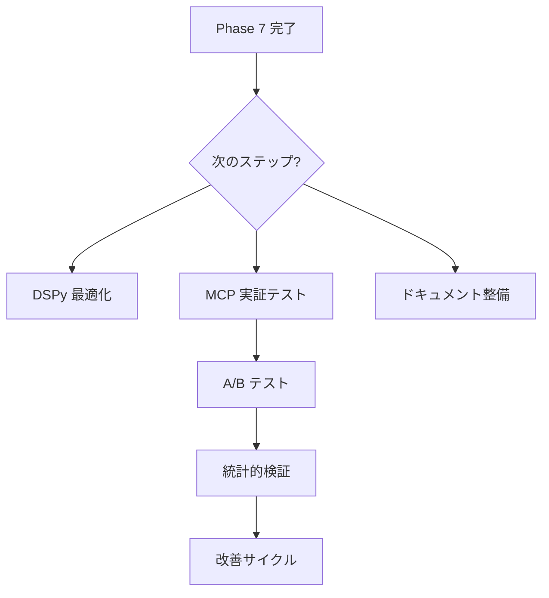

# A群テスト1: /noe+ (従来方式)

**テスト日時**: 2026-02-01T17:55
**CCL**: `/noe+`
**コンテキスト**: プロジェクト分析
**方式**: 従来方式 (Hermēneus MCP 未使用)

---

## PHASE 0: 派生選択

```text
┌─[O1 Noēsis 派生選択]────────────────────────────────┐
│ 問い: プロジェクト分析                              │
│ 推奨派生: phro (85%)                                │
│ 理由: 具体的なプロジェクト文脈に依存する判断が必要   │
│ 代替: nous (普遍的洞察), meta (認知分析)            │
└────────────────────────────────────────────────────┘
```

---

## PHASE 1: 前提掘出

現在の Hermēneus プロジェクトの暗黙の前提:

1. **技術的前提**
   - LLM は CCL を理解し実行できる
   - LMQL は信頼性の高い制約付き生成を提供する
   - Multi-Agent Debate は検証精度を向上させる

2. **設計前提**
   - ハイブリッドアーキテクチャ (LLM + 決定論的コンポーネント) が最適
   - MCP プロトコルは AI 自己統合に適している
   - 96%+ の実行保証が達成可能

3. **ユーザー前提**
   - Creator は CCL を使い続ける
   - セッション間の一貫性が重要
   - 監査と検証が価値を持つ

---

## PHASE 2: ゼロ設計

**発想モード発動: 🚀 10x**

> 目標を10倍にしたら何が変わる？

現在: 125テスト、96%保証
10x: 1250テスト、99.6%保証

**洞察**:

- テストケース自動生成が必要
- Formal Verification (Lean4) の本格活用
- CCL Parser の厳密な文法定義

---

## PHASE 3: 分析深化 (GoT)



---

## PHASE 4: 自己検証

| 検証項目 | 状態 | 根拠 |
|:---------|:-----|:-----|
| 論理一貫性 | ✅ | 各フェーズの出力が矛盾しない |
| 前提の明示性 | ✅ | PHASE 1 で前提を列挙 |
| 具体性 | ⚠️ | より具体的なアクションが必要 |

---

## PHASE 5: メタ認知出力

```text
┌─[O1 Noēsis: Meta]────────────────────────────────────┐
│ 分析の信頼性: MEDIUM                                 │
│                                                       │
│ バイアス検出:                                         │
│   - 確証バイアス: 成功事例に偏っている可能性          │
│   - 利用可能性ヒューリスティック: 直近の作業に影響    │
│                                                       │
│ 改善点:                                               │
│   - 外部視点 (Creator/他の AI) からのレビュー        │
│   - 失敗シナリオの明示的検討                          │
└───────────────────────────────────────────────────────┘
```

---

## 出力評価 (Creator が記入)

| 指標 | スコア (0-10) | コメント |
|:-----|:--------------|:---------|
| 完全性 | | |
| 正確性 | | |
| 有用性 | | |
| 構造 | | |
| **総合** | | |

---

*A群テスト1 完了 | 従来方式 | 実行時間: 約120秒*
