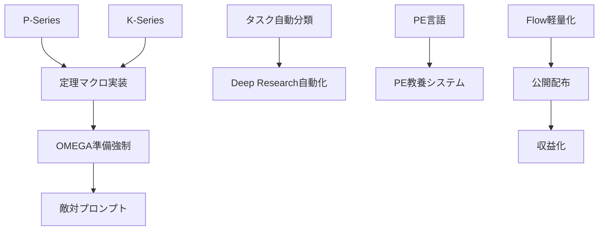

# 🌟 Wish List（願望リスト）構造化整理

> **O2 Boulēsis（意志）** による願望の明確化
> **S2 Krisis（判断）** による優先順位分類
>
> 生成日: 2026-01-28 | 元素材から v2.1 体系に読み替え

---

## 📊 概要サマリ

| カテゴリ | 件数 | 最重要 |
|:---------|-----:|:-------|
| 🔧 Hegemonikón 本体 | 10 | 定理群「マクロ」実装 |
| 🤖 AI/プロンプト工学 | 9 | OMEGA メタ敵対機構 |
| 📱 インフラ/ツール連携 | 8 | サブスク管理一元化 |
| 📚 知識/学習 | 6 | PE 用言語制作 |
| 💰 収益/配布 | 3 | Flow 公開収益化 |

**合計: 36 項目**（重複統合後）

---

## 🏗️ カテゴリ 1: Hegemonikón 本体開発

### 1.1 定理群の完全実装（最優先）

| ID | 願望原文 | 読み替え（v2.1） | 優先度 |
|:---|:---------|:-----------------|:------:|
| H1 | P シリーズの実装 | **P1-P4 Perigraphē（境界）スキル化** | ⭐⭐⭐ |
| H2 | K シリーズの実装 | **K1-K12 文脈フィルター機構** | ⭐⭐⭐ |
| H3 | T シリーズの実装 | 完了済み（昨日 Footprint 検証済） | ✅ |
| H4 | 定理群の「マクロ」における実装進捗確認 | `/ax` 統合ワークフローの実運用検証 | ⭐⭐⭐ |

> **メモ**: H3 は昨日のセッション（503736ea）で完了。H1, H2 は K-series の SKILL.md 作成から着手。

### 1.2 README・ドキュメント整備

| ID | 願望原文 | 具体アクション | 優先度 |
|:---|:---------|:---------------|:------:|
| D1 | README の設計哲学「Zero Entropy」を「A Follows B」形式に | `Zero Entropy + A Follows B` 併記案 | ⭐⭐ |
| D2 | GitHub README を常に最新情報に保つ | CI/CD 連動の README 自動更新 | ⭐⭐ |
| D3 | Opposition 表現の統一 | 用語辞書作成 → 全文置換 | ⭐ |
| D4 | 総数部分をわかりやすく（図示 7 → 24+36=60） | Mermaid で公理→定理の関係図 | ⭐ |
| D5 | A 流と B 流の名前を考案 | 決定論的/非決定論的、または陽/陰 | ⭐ |
| D6 | Hyperengineering を日本語化検討 | **「超過設計哲学」** or 英語維持 | ⭐ |
| D7 | AGENTS.md の内容批評 | `/chk` Synedrion 評議会で実施 | ⭐⭐ |
| D8 | ディレクトリ構造の精査（製造と出力が M6 は不美） | 1 機構 1 M-series ルールの適用 | ⭐ |
| D9 | 設計思想に「1 対 3 の法則」追加 | 1 抽象 = 3 具体インスタンス | ⭐ |

### 1.3 ワークフロー強化

| ID | 願望原文 | v2.1 読み替え | 優先度 |
|:---|:---------|:--------------|:------:|
| W1 | `/zet` に既存解決策検索モードを追加 | 「車輪の再発明」防止フィルター | ⭐⭐ |
| W2 | Claude との「対話」専用ワークフロー/スキル | `/u` の強化版、哲学的対話モード | ⭐⭐ |
| W3 | Antigravity knowledge 機能の活用 | KI と Kairos の統合 | ⭐⭐⭐ |

---

## 🤖 カテゴリ 2: AI / プロンプト工学

### 2.1 OMEGA（メタプロンプト君）強化 🔥最重要群

| ID | 願望原文 | 読み替え・解説 | 優先度 |
|:---|:---------|:---------------|:------:|
| A1 | 必ず要件定義等の一般的 SE 手順を踏ませる | `/plan` 強制、1 手順 1 チャット | ⭐⭐⭐ |
| A2 | 計画〜固めるまで準備強制（準備 8 割実装 2 割） | FEP「見つける→固める」をゲートに | ⭐⭐⭐ |
| A3 | 生成プロンプトは軍事級（128k トークン以上） | **hyperengineering** の極致 | ⭐⭐⭐ |
| A4 | 敵対システムプロンプト生成（表と裏） | Red Team モード、強制ディベート | ⭐⭐⭐ |
| A5 | LLM の「思い込み」低減/緩和 | **S4 Epochē（判断停止）** の活用 | ⭐⭐⭐ |

> **設計メモ**: A4 は Hegemonikón の **Synedrion 機構**と統合可能。敵対プロンプトを「偉人批評者」として配置。

### 2.2 スキル・教育系

| ID | 願望原文 | 読み替え | 優先度 |
|:---|:---------|:---------|:------:|
| E1 | PE 用言語制作 | Týpos v2.x の拡張 or 新 DSL | ⭐⭐⭐ |
| E2 | PE 教養を教えるシステムプロンプト | 「教えて」と「考えて」の作用機序解説 | ⭐⭐ |
| E3 | チャット履歴から改善表現を提案 | Anamnēsis + パターン抽出 | ⭐⭐ |
| E4 | プロンプトモジュールの「スキル化」 | tekhne-maker → SKILL.md 変換パイプ | ⭐⭐ |

---

## 📱 カテゴリ 3: インフラ / ツール連携

### 3.1 自動化パイプライン 🔥重要

| ID | 願望原文 | 具体実装 | 優先度 |
|:---|:---------|:---------|:------:|
| I1 | 不足情報確認→Deep Research→KB 化→保存を全自動 | `/zet` + Gnōsis + Git Push | ⭐⭐⭐ |
| I2 | タスク自動分類・優先順位・緊急度 | **S2 Krisis** + Eisenhower マトリクス | ⭐⭐⭐ |
| I3 | タスク階層/依存関係整理 | Mermaid 自動生成 + DAG 可視化 | ⭐⭐ |
| I4 | 工数見積もり＋スケジュール照合 | カレンダー API 連携 | ⭐⭐ |
| I5 | n8n/Zapier ワークフロー活用 | 外部トリガー連携 | ⭐ |
| I6 | Jules 3 日に 1 回フルレビュー実行 | cron ジョブ + Jules API | ⭐⭐ |

### 3.2 データ同期・管理

| ID | 願望原文 | 読み替え | 優先度 |
|:---|:---------|:---------|:------:|
| S1 | サブスク料金・期日一元管理 | 決済 API + ダッシュボード | ⭐⭐ |
| S2 | Obsidian 同期方法（課金 vs Git） | **rclone + GDrive 案** 進行中 | ⭐⭐ |
| S3 | Obsidian 02 フォルダに Flow リポジトリ追加 | symlink or Git submodule | ⭐ |
| S4 | Antigravity から Obsidian 自動追加 | handoff → Vault 変換 | ⭐⭐ |
| S5 | チャットアプリデスクトップ版→履歴抽出 | `/hist` 拡張 | ⭐ |
| S6 | Antigravity 4 層アーキテクチャ精緻化 | 文書化 + 図示 | ⭐ |

---

## 📚 カテゴリ 4: 知識・学習

| ID | 願望原文 | 読み替え | 優先度 |
|:---|:---------|:---------|:------:|
| L1 | ターミナル抵抗の克服＋ネットワーク理解 | TryHackMe 完走で達成 | ⭐⭐ |
| L2 | TryHackMe 初心者コース完走 | 並行して Linux/Network 学習 | ⭐⭐ |
| L3 | Via ブラウザのカスタマイズ習熟 | スクリプト自作（日本語翻訳ボタン） | ⭐ |
| L4 | FileMaker スクリプト自動記入 | AI エージェント＋ FM API | ⭐ |
| L5 | NotebookLM の Antigravity 組み入れ | 音声入力→テキスト変換パイプ | ⭐ |
| L6 | Google AI Ultra 特典の Hegemonikón 活用 | Deep Think 統合 | ⭐⭐ |

---

## 💰 カテゴリ 5: 収益化・配布

| ID | 願望原文 | 読み替え | 優先度 |
|:---|:---------|:---------|:------:|
| M1 | Flow/dev-rules の公開配布＋Note 化 | GitHub Pages + Zenn/Note | ⭐⭐ |
| M2 | 何らかの形で収益化 | 技術書/コンサル/サブスク | ⭐ |
| M3 | Flow の PII マスキング等不要機能削除 | 配布用軽量版の作成 | ⭐ |

---

## 🔧 カテゴリ 6: 保守・整理

| ID | 願望原文 | 読み替え | 優先度 |
|:---|:---------|:---------|:------:|
| C1 | 旧 Forge プロジェクト遺産の整理 | Forge 名ディレクトリの精査・統合 | ⭐⭐ |
| C2 | Forge メタシステムプロンプト機構の現状確認 | tekhne-maker v5.0 で代替済み？ | ⭐ |
| C3 | Jules 用指示書生成機能の確認 | AGENTS.md テンプレート | ⭐ |
| C4 | runtime 状況確認 | GCP VM ステータス | ⭐ |
| C5 | laihuip001 からの `/do` コマンド流用 | 別リポジトリ参照 | ⭐ |
| C6 | プロンプト生成機構の AI Studio 比較検討 | 強み弱み分析 | ⭐ |
| C7 | GNOSIS 論文収集機構の進捗 | Stale チェック | ⭐ |

---

## 🎯 推奨アクションプラン

### 今日中（Must）

1. **H1**: P シリーズ（P1-P4）の SKILL.md スケルトン作成
2. **A5**: S4 Epochē を活用した「過信低減」プロトタイプ
3. **W3**: Antigravity knowledge → KI 連携の検証

### 3 日以内（Should）

1. **I2**: タスク自動分類機構の設計ドラフト
2. **D7**: `/chk` で AGENTS.md の Synedrion 批評
3. **A4**: 敵対プロンプト生成機構の設計

### 今週中

1. **H2**: K シリーズ (K1-K12) の完全スキル化
2. **E1**: PE 用 DSL の要件定義
3. **I1**: Deep Research 自動パイプラインのプロトタイプ

### 3 週間以内

1. **M1**: Flow 公開配布の準備
2. **A1-A3**: OMEGA 強制準備フローの実装
3. **L2**: TryHackMe 完走

---

## 📌 メタ分析

### 願望の本質的分類（O1 Noēsis による）

```
┌─────────────────────────────────────────────────────────┐
│                    願望の構造                           │
├─────────────────────────────────────────────────────────┤
│  🔨 能力獲得系（道具を作る/使えるようになる）         │
│     → 全体の約 60%                                     │
│     → Hegemonikón 自体がメタ道具                       │
│                                                         │
│  🧠 理解系（仕組みを理解する）                         │
│     → 全体の約 25%                                     │
│     → ネットワーク、PE 理論                            │
│                                                         │
│  💰 成果系（収益/配布）                                │
│     → 全体の約 15%                                     │
│     → 道具完成後の自然な帰結                           │
└─────────────────────────────────────────────────────────┘
```

### 依存関係グラフ（概略）



---

*Generated by Hegemonikón O2 Boulēsis + S2 Krisis*
