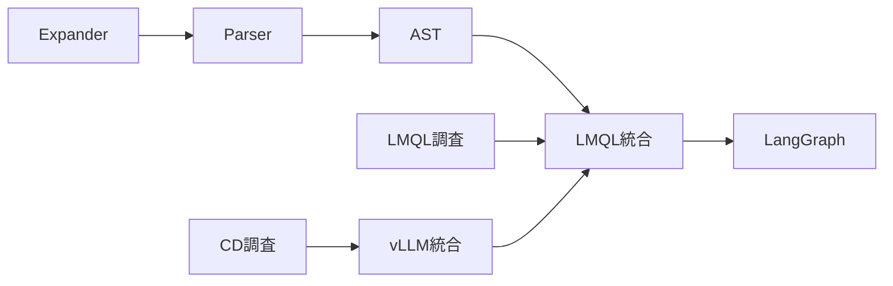

# /tak+ 分析: Hermēneus ロードマップ

> **Date**: 2026-01-31
> **Project**: Hermēneus (CCL 実行保証コンパイラ)

---

## 入力タスク

1. Expander + Parser 完成（PoC → 正式版）
2. LMQL ランタイム統合
3. Constrained Decoding 統合
4. LangGraph 統合

---

## PHASE 2: 優先度・緊急度分類 (Eisenhower)

| タスク | 緊急度 | 重要度 | 分類 |
|:-------|:-------|:-------|:-----|
| Expander + Parser | 中 | 高 | **Must** |
| LMQL 統合 | 低 | 高 | **Should** |
| Constrained Decoding | 低 | 高 | **Should** |
| LangGraph | 低 | 中 | **Could** |

---

## PHASE 3: 階層化

```
🎯 Hermēneus (CCL Compiler)
   │
   ├─ Epic 1: 翻訳層
   │   ├─ Task 1.1: Expander 正式版
   │   ├─ Task 1.2: Parser 正式版 (EBNF/Lark)
   │   └─ Task 1.3: AST 定義
   │
   ├─ Epic 2: 実行層
   │   ├─ Task 2.1: LMQL ランタイム調査
   │   ├─ Task 2.2: LMQL 統合
   │   └─ Task 2.3: LangGraph 統合
   │
   └─ Epic 3: 検証層
       ├─ Task 3.1: Constrained Decoding 調査
       ├─ Task 3.2: vLLM + xgrammar 統合
       └─ Task 3.3: Multi-Agent Debate 実装
```

---

## PHASE 4: 依存関係



**クリティカルパス**: 1.1 → 1.2 → 1.3 → 2.2

---

## PHASE 5: 不足情報

| カテゴリ | 不足 | 解決方法 |
|:---------|:-----|:---------|
| TECHNICAL | LMQL の Python 3.11 互換性 | `/sop` 調査 |
| TECHNICAL | vLLM の GCP 対応 | `/sop` 調査 |
| RESOURCE | GPU リソース要否 | 確認必要 |

---

## PHASE 6: 工数見積

| タスク | サイズ | 時間目安 |
|:-------|:-------|:---------|
| 1.1 Expander | S | 2-3h |
| 1.2 Parser (Lark) | M | 4-6h |
| 1.3 AST | S | 1-2h |
| 2.1 LMQL 調査 | S | 2h |
| 2.2 LMQL 統合 | L | 6-8h |
| 2.3 LangGraph | L | 6-8h |
| 3.1 CD 調査 | S | 2h |
| 3.2 vLLM 統合 | M | 4-6h |

**合計**: 27-37h（1-2週間）

---

## PHASE 8: Must/Should 提示

### 🔴 TODAY

なし

### 🟠 3DAYS

なし

### 🟡 WEEK (Must)

| # | タスク | 工数 |
|:--|:-------|:-----|
| 1 | 1.1 Expander 正式版 | S |
| 2 | 1.2 Parser (Lark) 正式版 | M |
| 3 | 1.3 AST 定義 | S |

### 🟢 3WEEKS (Should)

| # | タスク | 工数 |
|:--|:-------|:-----|
| 4 | 2.1 LMQL 調査 | S |
| 5 | 2.2 LMQL 統合 | L |
| 6 | 3.1 Constrained Decoding 調査 | S |
| 7 | 3.2 vLLM 統合 | M |

### 🔵 2MONTHS (Could)

| # | タスク | 工数 |
|:--|:-------|:-----|
| 8 | 2.3 LangGraph 統合 | L |
| 9 | 3.3 Multi-Agent Debate | L |

---

## 次のアクション

```ccl
/ene[next]:
    1. hermeneus/src/ にファイル移動
    2. Lark 文法ファイル作成
    3. テスト追加
```

---

*Generated by /tak+ (2026-01-31)*
