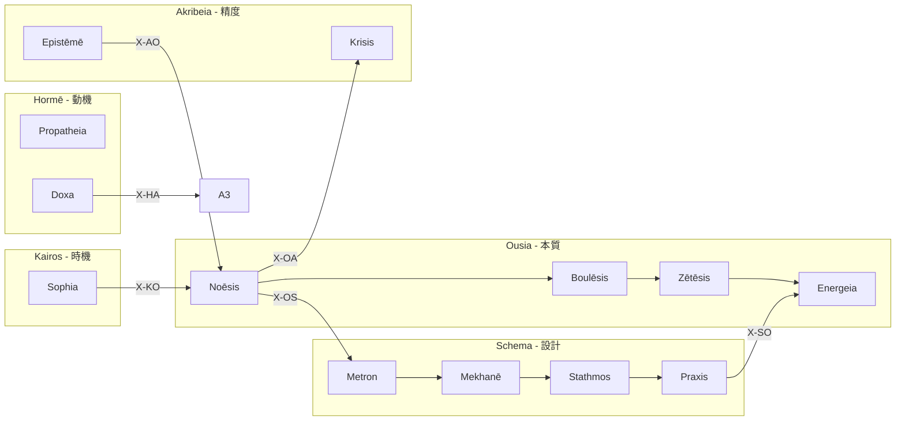

# X-series 36関係ガイド — 3日後の自分へ

> **バージョン**: v1.0 | **生成日**: 2026-01-29
> **対象**: 3日後の Creator と Claude
> **基準**: 「次に何をすべきか」が直感でわかる

---

## 1. X-series とは

**X = 関係 (Relation)**

6つの Hub が互いにどう繋がるかを定義する層。

```
       ┌─────── X-OS ───────┐
       │                    │
   O ←─┼─→ S ←───→ H ←───→ P
       │    ↓       ↓       ↓
       └─→ K ←───→ A ←─────┘
```

**使い道**: WF 実行後、「次は何？」と迷ったら X-series を見る。

---

## 2. 速引き: 今いる場所 → 次

### 今 O-series (認識) にいる

| 行き先 | 式 | なぜ |
|:-------|:---|:-----|
| **→ S** | `/s` | **認識した後は設計** (一番多い) |
| → K | `/kho` | 時間・文脈を確認 |
| → A | `/dia` | 認識を検証 |
| → H | `/pro` | 感情的反応を確認 |

### 今 S-series (設計) にいる

| 行き先 | 式 | なぜ |
|:-------|:---|:-----|
| **→ O** | `/ene` | **設計を実行** (一番多い) |
| → K | `/chr` | タイムライン確認 |
| → A | `/sta` | 基準を確認 |
| → H | `/dox` | 信念として記録 |

### 今 H-series (動機) にいる

| 行き先 | 式 | なぜ |
|:-------|:---|:-----|
| **→ A** | `/pat` | **感情を精緻化** |
| → O | `/bou` | 意志を明確化 |
| → S | `/mek` | 方法を考える |

### 今 P-series (境界) にいる

| 行き先 | 式 | なぜ |
|:-------|:---|:-----|
| **→ S** | `/tek` | **技法を決める** |
| → O | `/ene` | 実行へ |
| → K | `/chr` | 時間配置 |

### 今 K-series (時機) にいる

| 行き先 | 式 | なぜ |
|:-------|:---|:-----|
| **→ O** | `/noe` | **知恵から本質へ還る** |
| → A | `/epi` | 知識確定 |
| → S | `/met` | スケール決定 |

### 今 A-series (精度) にいる

| 行き先 | 式 | なぜ |
|:-------|:---|:-----|
| **→ O** | `/noe` | **知識から新たな認識へ** |
| → K | `/tel` | 目的確認 |
| → S | `/sta` | 基準調整 |

---

## 3. Sacred Routes (よく使う経路)

### 🏛️ The Architect's Route: O → S

```
認識 → 設計
/noe → /s
```

**場面**: 何かを理解した後、それを形にしたい

### ⏱️ The Strategist's Route: S → K

```
設計 → 時機
/s → /chr
```

**場面**: 計画を時間軸に配置したい

### 🔬 The Scientist's Route: H → A

```
衝動 → 精密
/pro → /dia
```

**場面**: 直感を検証したい

### 🧘 The Philosopher's Route: K → O

```
時機 → 認識
/sop → /noe
```

**場面**: 調査から本質を抽出したい

### 🔄 The Cycle: O → S → O

```
認識 → 設計 → 実行 → 認識'
/noe → /s → /ene → /noe
```

**場面**: 反復開発、スプリント

---

## 4. 36関係一覧 (全展開)

### X-O: O から出発

| ID | → | 意味 | 典型経路 |
|:---|:--|:-----|:---------|
| X-OO | O | 本質内循環 | O3→O1 (問い→認識) |
| X-OS | S | 本質→設計 | O1→S1 (スケール決定) |
| X-OH | H | 本質→衝動 | O1→H1 (初期反応) |
| X-OP | P | 本質→環境 | O4→P4 (技法選択) |
| X-OK | K | 本質→文脈 | O2→K3 (目的確認) |
| X-OA | A | 本質→精密 | O1→A2 (判定) |

### X-S: S から出発

| ID | → | 意味 | 典型経路 |
|:---|:--|:-----|:---------|
| X-SO | O | 設計→本質 | S4→O4 (実行) |
| X-SS | S | 設計内循環 | S1→S4 |
| X-SH | H | 設計→衝動 | S4→H4 (信念記録) |
| X-SP | P | 設計→環境 | S1→P1 (場決定) |
| X-SK | K | 設計→文脈 | S3→K3 (目的照合) |
| X-SA | A | 設計→精密 | S3→A2 (基準検証) |

### X-H: H から出発

| ID | → | 意味 | 典型経路 |
|:---|:--|:-----|:---------|
| X-HO | O | 衝動→本質 | H2→O4 |
| X-HS | S | 衝動→設計 | H4→S4 |
| X-HH | H | 衝動内循環 | H1→H2 |
| X-HP | P | 衝動→環境 | H3→P1 |
| X-HK | K | 衝動→文脈 | H4→K4 |
| X-HA | A | 衝動→精密 | H4→A3 |

### X-P: P から出発

| ID | → | 意味 | 典型経路 |
|:---|:--|:-----|:---------|
| X-PO | O | 環境→本質 | P4→O4 |
| X-PS | S | 環境→設計 | P4→S2 |
| X-PH | H | 環境→衝動 | P1→H3 |
| X-PP | P | 環境内循環 | P1→P2 |
| X-PK | K | 環境→文脈 | P3→K2 |
| X-PA | A | 環境→精密 | P4→A4 |

### X-K: K から出発

| ID | → | 意味 | 典型経路 |
|:---|:--|:-----|:---------|
| X-KO | O | 文脈→本質 | K4→O1 **(哲学者の道)** |
| X-KS | S | 文脈→設計 | K2→S1 |
| X-KH | H | 文脈→衝動 | K1→H1 |
| X-KP | P | 文脈→環境 | K3→P3 |
| X-KK | K | 文脈内循環 | K1→K3 |
| X-KA | A | 文脈→精密 | K4→A4 |

### X-A: A から出発

| ID | → | 意味 | 典型経路 |
|:---|:--|:-----|:---------|
| X-AO | O | 精密→本質 | A4→O1 **(知識→認識)** |
| X-AS | S | 精密→設計 | A3→S3 |
| X-AH | H | 精密→衝動 | A1→H1 |
| X-AP | P | 精密→環境 | A4→P4 |
| X-AK | K | 精密→文脈 | A2→K1 |
| X-AA | A | 精密内循環 | A2→A4 |

---

## 5. Universal X-Fusion

> **公理**: W = W * X
> すべてのワークフローは暗黙的に X-series と融合する

### つまり

```
/noe  = /noe * X
/s    = /s * X
/ene  = /ene * X
```

すべての WF 実行後、自動的に X-series が「次の候補」を提示する。

---

## 6. 出力例

WF 完了後に表示される:

```
┌─[Hegemonikón]──────────────────────────────────────────┐
│ /noe 完了                                               │
│                                                        │
│ ⏭️ X-series 推奨:                                       │
│   → /s   (X-OS: 認識→設計)                             │
│   → /dia (X-OA: 認識→検証)                             │
│   → /pro (X-OH: 認識→傾向)                             │
└────────────────────────────────────────────────────────┘
```

---

## 7. Mermaid 図



---

## 8. 覚えなくていい

**FEP が自動で推奨する**。

`workflow_runner.py` を使えば、WF完了後に自動で「次の候補」が出る。

```bash
python workflow_runner.py --execute /noe "本質は何か"
# → X-series recommendations: [/s, /dia, /pro]
```

---

*Generated by Hegemonikón `/s+_/ene+` | Tier 3 Complete*
