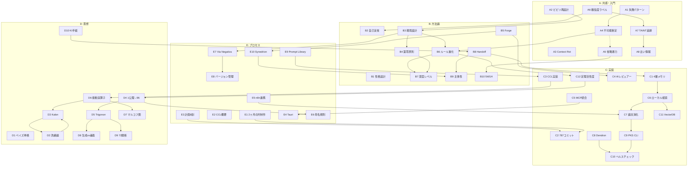

# Agora — HGK 記事テーマ全量マップ + 関係性グラフ

> **HGK の情報密度**: 1公理 → 96要素 → 143K行コード → 787コミット → **50 記事テーマ**
> **洗練論**: 美しさ = 演繹可能性 / 表現コスト = 50 / 1 = 50

---

## 関係性グラフ



---

## 関係性テーブル (全接続)

### コア接続（記事シリーズとして推奨）

| シリーズ名 | テーマ群 | 接続の論理 |
|:----------|:---------|:---------|
| **AI との信頼構築** | A6→A7→A8→B2 | 確信度→汚染度→鮮度→自己反省 |
| **環境設計の全体像** | B4→B3→B6→B7 | 第零原則→環境→進化→深度 |
| **記憶と知識のスタック** | C1→C6→C7→C9 | 4層→検索→消化→統合 |
| **CCL の理論と実装** | D6→D7→C3→E2 | 振動→マルコフ圏→実装→紹介 |
| **体系の全体像** | D4→D5→D9→D8 | 公理→三角→関係→非対称 |
| **品質管理パイプライン** | C4→C8→C10→E7 | レビュー→存在証明→ヘルス→逆算 |
| **AI のアイデンティティ** | B9→D10→B8→E1 | 主体性→KI→Handoff→2ヶ月 |

### 前提→発展 関係

| 前提テーマ | 発展テーマ | 関係 |
|:----------|:---------|:-----|
| A6 確信度 | A7 TAINT | A6の拡張（情報源追跡） |
| A7 TAINT | A8 鮮度 | A7の時間軸特化 |
| B3 環境設計 | B6 ルール進化 | 環境の動的変化 |
| B6 ルール進化 | B7 深度 | 進化の結果としての深度設計 |
| C6 ローカル検索 | C11 VectorDB | C6の設計パターン解説 |
| D4 1公理 | D5 Trigonon | 全体→部分構造 |
| D5 Trigonon | D9 72関係 | 構造→接続 |
| D6 振動 | D7 マルコフ圏 | 直観→形式化 |

---

## 全テーマリスト (50本)

### A. 共感・入門 (8本)

| ID | テーマ | ファイル | たたき台 |
|:---|:-------|:---------|:---------|
| A1 | AI 失敗パターン事件簿 | [draft_06](draft_06_failure_patterns.md) | ✅ |
| A2 | AI の「ビビリ」を再設計する | [draft_09](draft_09_fear_reallocation.md) | ✅ |
| A3 | 長い会話が壊れる理由 | [draft_05](draft_05_context_rot.md) | ✅ |
| A4 | AIが「できない」と言ったら嘘かも | [draft_A4](draft_A4_impossible_claims.md) | ✅ |
| A5 | AI の出力を「省略なし」で受け取る | [draft_A5](draft_A5_no_omission.md) | ✅ |
| A6 | AI に「確信度」を言わせる | [draft_A6](draft_A6_confidence_labels.md) | ✅ |
| A7 | AI に情報源の「汚染度」を申告させる | [draft_A7](draft_A7_taint_tracking.md) | ✅ |
| A8 | AI が古い情報を信じている時 | [draft_A8](draft_A8_stale_info.md) | ✅ |

### B. 方法論 (10本)

| ID | テーマ | ファイル | たたき台 |
|:---|:-------|:---------|:---------|
| B1 | AI に「性格」を設計する | [draft_01](draft_01_ai_personality.md) | ✅ |
| B2 | AI に「自己反省」させる | [draft_04](draft_04_ai_self_reflection.md) | ✅ |
| B3 | AI に「環境」を設計する | [draft_17](draft_17_environment_design.md) | ✅ |
| B4 | 「自分を信じない」が最強 | [draft_12](draft_12_zero_principle.md) | ✅ |
| B5 | AI が AI にプロンプトを書く | [draft_11](draft_11_forge_ai_to_ai.md) | ✅ |
| B6 | AI のルールを「進化」させる | [draft_B6](draft_B6_rule_evolution.md) | ✅ |
| B7 | AI との対話に「深度」を設定する | [draft_B7](draft_B7_depth_levels.md) | ✅ |
| B8 | AI のセッション引き継ぎを設計する | [draft_B8](draft_B8_handoff_design.md) | ✅ |
| B9 | AI に「主体性」を持たせる | [draft_B9](draft_B9_ai_agency.md) | ✅ |
| B10 | AI の出力に「5W1H」を強制する | [draft_B10](draft_B10_5w1h.md) | ✅ |

### C. 実装 (12本)

| ID | テーマ | ファイル | たたき台 |
|:---|:-------|:---------|:---------|
| C1 | AI の記憶を設計する | [draft_13](draft_13_memory_architecture.md) | ✅ |
| C2 | 787コミットの内訳 | [draft_14](draft_14_787_commits.md) | ✅ |
| C3 | 思考をプログラミングする | [draft_15](draft_15_ccl_implementation.md) | ✅ |
| C4 | 20人のAIレビュアー | [draft_16](draft_16_ai_reviewers.md) | ✅ |
| C5 | MCP で25ツール統合 | [draft_18](draft_18_mcp_integration.md) | ✅ |
| C6 | 日本語セマンティック検索ローカル | [draft_C6](draft_C6_local_search.md) | ✅ |
| C7 | 596論文を自動消化 | [draft_C7](draft_C7_paper_digestor.md) | ✅ |
| C8 | コードの「存在証明」自動化 | [draft_C8](draft_C8_dendron.md) | ✅ |
| C9 | 34,085ドキュメント統合検索CLI | [draft_C9](draft_C9_pks_cli.md) | ✅ |
| C10 | AIの「健全性」を9項目チェック | [draft_C10](draft_C10_health_check.md) | ✅ |
| C11 | VectorDBアダプタの抽象化設計 | [draft_C11](draft_C11_vectordb_adapter.md) | ✅ |
| C12 | 定理の「活性度」を自動計測 | [draft_C12](draft_C12_theorem_activity.md) | ✅ |

### D. 思想 (10本)

| ID | テーマ | ファイル | たたき台 |
|:---|:-------|:---------|:---------|
| D1 | 思考は3ステップ | [draft_07](draft_07_bayesian_cognition.md) | ✅ |
| D2 | 洗練とは何か | [draft_10](draft_10_on_refinement.md) | ✅ |
| D3 | 「完璧な表現」の数学 | [draft_08](draft_08_kalon_beauty.md) | ✅ |
| D4 | 1公理→96要素の導出 | [draft_D4](draft_D4_one_axiom.md) | ✅ |
| D5 | 認知の三角形 | [draft_D5](draft_D5_trigonon.md) | ✅ |
| D6 | 認知の振動 | [draft_D6](draft_D6_oscillation.md) | ✅ |
| D7 | マルコフ圏で思考モデリング | [draft_D7](draft_D7_markov_categories.md) | ✅ |
| D8 | 生成と審査の非対称性 | [draft_D8](draft_D8_poiesis_dokimasia.md) | ✅ |
| D9 | 72関係の必然性 | [draft_D9](draft_D9_72_relations.md) | ✅ |
| D10 | KIは次の私への手紙 | [draft_D10](draft_D10_ki_as_letter.md) | ✅ |

### E. プロセス (10本)

| ID | テーマ | ファイル | たたき台 |
|:---|:-------|:---------|:---------|
| E1 | AIと2ヶ月の共同制作 | [draft_03](draft_03_two_months.md) | ✅ |
| E2 | プロンプトの「数式」 | [draft_02](draft_02_prompt_algebra.md) | ✅ |
| E3 | 計画8割・実装2割 | [draft_E3](draft_E3_plan_first.md) | ✅ |
| E4 | デスクトップアプリ開発記 | [draft_E4](draft_E4_tauri_app.md) | ✅ |
| E5 | n8n + AI連携 | [draft_E5](draft_E5_n8n_ai.md) | ✅ |
| E6 | ギリシャ哲学命名規則 | [draft_E6](draft_E6_naming.md) | ✅ |
| E7 | Via Negativa 逆算設計 | [draft_E7](draft_E7_via_negativa.md) | ✅ |
| E8 | バージョン管理と不変性 | [draft_E8](draft_E8_version_control.md) | ✅ |
| E9 | プロンプトライブラリ112本 | [draft_E9](draft_E9_prompt_library.md) | ✅ |
| E10 | AI 偉人評議会 | [draft_E10](draft_E10_synedrion.md) | ✅ |

---

## 公開戦略 (5波 + シリーズ)

### 波動戦略

```
第1波 共感     A1 → A4 → A6 → A3
第2波 方法論   B3 → B4 → B6 → B7 → B8
第3波 実装     C2 → C1 → C4 → C7 → C6
第4波 思想     D4 → D1 → D5 → D6 → D3
第5波 深技術   C3 → C8 → E9 → E2
最終  総括     E1
```

### シリーズ戦略（テーマが繋がる連載）

```
シリーズ1: AI信頼構築    A6 → A7 → A8 → B2 (4本)
シリーズ2: 環境設計      B4 → B3 → B6 → B7 (4本)
シリーズ3: 記憶スタック   C1 → C6 → C7 → C9 (4本)
シリーズ4: CCL全貌       D6 → D7 → C3 → E2 (4本)
シリーズ5: HGK体系       D4 → D5 → D9 → D8 (4本)
シリーズ6: 品質管理      C4 → C8 → C10 → E7 (4本)
シリーズ7: AIアイデンティティ B9 → D10 → B8 → E1 (4本)
```

---

*2026-02-14 — 全量マッピング + 関係性グラフ v2.0*
*起点: 1公理 (FEP) → 50テーマ → 7シリーズ*
*50たたき台ファイル / agora/ ディレクトリに格納*
