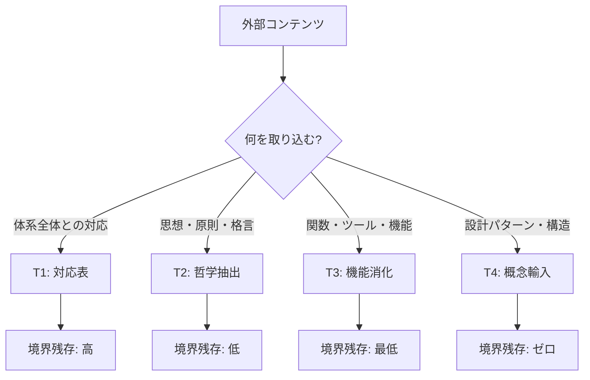

# 消化テンプレート (Digestion Templates)

> **CCL**: `/eat.template`
> **導出**: Pythōsis の経験から一般化
> **目的**: /eat v3.0 で消化する際の4パターン。何を消化しても、この4つのどれかに帰着する。

---

## 概要

外部コンテンツを HGK に消化する際、消化のされ方には**4つの基本パターン**がある。
これは /eat の Phase 1 (F 構築) で「どう自由構成するか」の選択肢に対応する。

```
消化対象 → G(分解) → 最小チャンク → F(自由構成) → ???
                                        ↓
                                   どのパターンで構成するか？
                                        ↓
                              ┌─── T1: 対応表 (Mapping)
                              ├─── T2: 哲学抽出 (Extraction)
                              ├─── T3: 機能消化 (Absorption)
                              └─── T4: 概念輸入 (Import)
```

---

## T1: 対応表 (Mapping)

> **F(X) = 既存 HGK 対象への射**

外部体系と HGK の間に**構造保存写像**を張る。新しい対象は作らない。

| 項目 | 内容 |
|:-----|:-----|
| **F の型** | F: Ext → Int（既存対象への射を定義） |
| **生成物** | 対応表（マッピングドキュメント） |
| **境界残存** | 高い（対応表自体が境界の記録） |
| **naturalization** | 対応表を読まなくても使える状態 |

### Pythōsis での実例

- **core_mapping.md**: Python ↔ HGK 対応表
- **wf_classification.md**: builtins → WF 分類

### 一般テンプレート

```yaml
T1_mapping:
  input: 外部体系 {name}
  output: mappings/{name}_mapping.md
  structure:
    完全対応:  # 1:1 射
      - "{外部概念A}" → "{HGK概念A'}"
    部分成立:  # 射は存在するが不完全
      - "{外部概念B}" → "{HGK概念B'}" (差分: ...)
    未対応:    # 射が存在しない
      - "{外部概念C}" → ??? (検討: T3 or T4 で追加?)
  verification:
    η: 対応表を逆に辿って元の体系を再現できるか
    ε: HGK 側から対応表を辿って外部概念を復元できるか
```

---

## T2: 哲学抽出 (Extraction)

> **F(X) = 既存 HGK 対象の追加属性**

外部体系の**格言・原則・思想**を抽出し、HGK の設計原則として吸収する。
新しい WF は作らないが、既存 WF の**設計根拠**が豊かになる。

| 項目 | 内容 |
|:-----|:-----|
| **F の型** | F: Ext → Enrichment(Int)（既存対象の属性拡張） |
| **生成物** | 原則マッピング、設計原則ドキュメント |
| **境界残存** | 低い（原則は出典を忘れても使える） |
| **naturalization** | 原則が「当たり前」になった状態 |

### Pythōsis での実例

- **zen_extraction.md**: Zen 19格言 → CCL 設計原則 17
- 「Explicit is better than implicit」 → CCL の `+` (詳細) デフォルト

### 一般テンプレート

```yaml
T2_extraction:
  input: 外部哲学/格言集 {name}
  output: designs/{name}_extraction.md
  structure:
    for_each 格言/原則:
      original: "{原文}"
      hgk_interpretation: "{HGK での解釈}"
      mapped_to: "{対応する公理/定理/WF}"
      ccl_principle: "{CCL 設計原則として}"
      anti_principle: "{反面教師としての解釈（あれば）}"
  verification:
    η: 原則から元の格言を再現できるか（出典追跡）
    ε: HGK 設計原則から外部哲学を忘却できるか（依存なし）
```

---

## T3: 機能消化 (Absorption)

> **F(X) = 新しい HGK 対象（WF派生/マクロ/演算子）**

外部体系の**機能・ツール・パターン**を HGK の語彙（WF/マクロ/演算子）として吸収する。
新しい「動詞」が生まれる。

| 項目 | 内容 |
|:-----|:-----|
| **F の型** | F: Ext → New(Int)（新規対象の生成） |
| **生成物** | WF 派生、マクロ定義、演算子追加 |
| **境界残存** | 最低（新しい語彙は HGK 固有になる） |
| **naturalization** | 元のライブラリ名を知らなくても使える状態 |

### Pythōsis での実例

- **stdlib_macros.md**: itertools → @chain/@cycle/@repeat, functools → @reduce/@partial
- **popular_libs.md**: typing → /epi.typed, dataclasses → /dox.structured, contextlib → @scoped v2, asyncio → `\|\|`/`\|>`
- **lambda.md**: Python lambda → `L:[x]{WF}`

### 一般テンプレート

```yaml
T3_absorption:
  input: 外部ライブラリ/ツール {name}
  output:
    - macros/{name}_macros.md (マクロの場合)
    - WF 派生の追加 ({wf}.md に統合)
    - operators.md への演算子追加
  structure:
    for_each 機能:
      python_function: "{元の関数/クラス}"
      ccl_form: "{@macro / WF派生 / 演算子}"
      rationale: "{なぜこの形にしたか}"
      usage_example: "{CCL での使用例}"
      anti_pattern: "{やってはいけない使い方}"
  verification:
    η: CCL 形式から元の機能仕様を再現できるか
    ε: 元のライブラリ名を知らなくても CCL で使えるか
```

---

## T4: 概念輸入 (Import)

> **F(X) = HGK のメタ構造の拡張**

外部体系の**設計パターン・アーキテクチャ概念**を輸入し、HGK の構造そのもの（kernel, CCL 文法）を拡張する。

| 項目 | 内容 |
|:-----|:-----|
| **F の型** | F: Ext → Meta(Int)（メタ構造の拡張） |
| **生成物** | kernel 拡張、CCL 文法追加 |
| **境界残存** | ゼロ（構造そのものになる） |
| **naturalization** | 輸入元を知る人がいなくても機能する |

### Pythōsis での実例

- **concepts.md B1**: 継承 → `extends` フィールド（kernel/*. md frontmatter）
- **concepts.md B2**: Mixin → `@with()` 構文、kernel/mixins/
- **concepts.md B3**: デコレータ → マクロシステム全体

### 一般テンプレート

```yaml
T4_import:
  input: 外部設計パターン {name}
  output:
    - kernel/ への拡張
    - CCL 文法の追加 (operators.md)
  structure:
    concept: "{概念名}"
    origin: "{輸入元}"
    hgk_implementation: "{HGK での実装形態}"
    kernel_changes: ["{変更内容}"]
    ccl_syntax: "{新構文（あれば）}"
  verification:
    η: 概念の説明から輸入元を特定できるか（Lineage 保存）
    ε: 輸入元を知らなくても概念を使えるか（完全吸収）
  caution: >
    T4 は HGK の構造自体を変更する。最も慎重を要するパターン。
    SACRED_TRUTH.md との矛盾が発生するリスクが最も高い。
    /fit の Anti-Spec 検証（Step 3.5）を必ず実行すること。
```

---

## パターン選択ガイド



| 判断基準 | T1 | T2 | T3 | T4 |
|:---------|:---:|:---:|:---:|:---:|
| 新しいWF/マクロが必要 | ❌ | ❌ | ✅ | ✅ |
| HGK 構造自体が変わる | ❌ | ❌ | ❌ | ✅ |
| Lineage 保持が重要 | ✅ | ✅ | ⚠️ | ⚠️ |
| naturalization の深さ | 浅 | 中 | 深 | 最深 |
| リスク | 低 | 低 | 中 | 高 |

---

## 次の消化候補 (参考)

| 候補 | 推奨パターン | 理由 |
|:-----|:-------------|:-----|
| Rust の設計思想 | T2 + T3 | 所有権/借用 → 認知リソース管理 |
| ストア哲学（深掘り） | T2 | すでに部分的に消化済み（定理命名） |
| 圏論（応用拡張） | T4 | 既に構造に組み込み済み。追加演算子候補 |
| Unix 哲学 | T2 | 「一つのことをうまくやれ」→ 既存原則と共鳴 |

---

*Digestion Templates v1.0 — Pythōsis の経験から一般化 (2026-02-10)*
